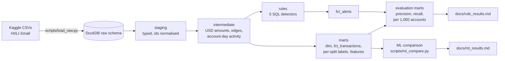
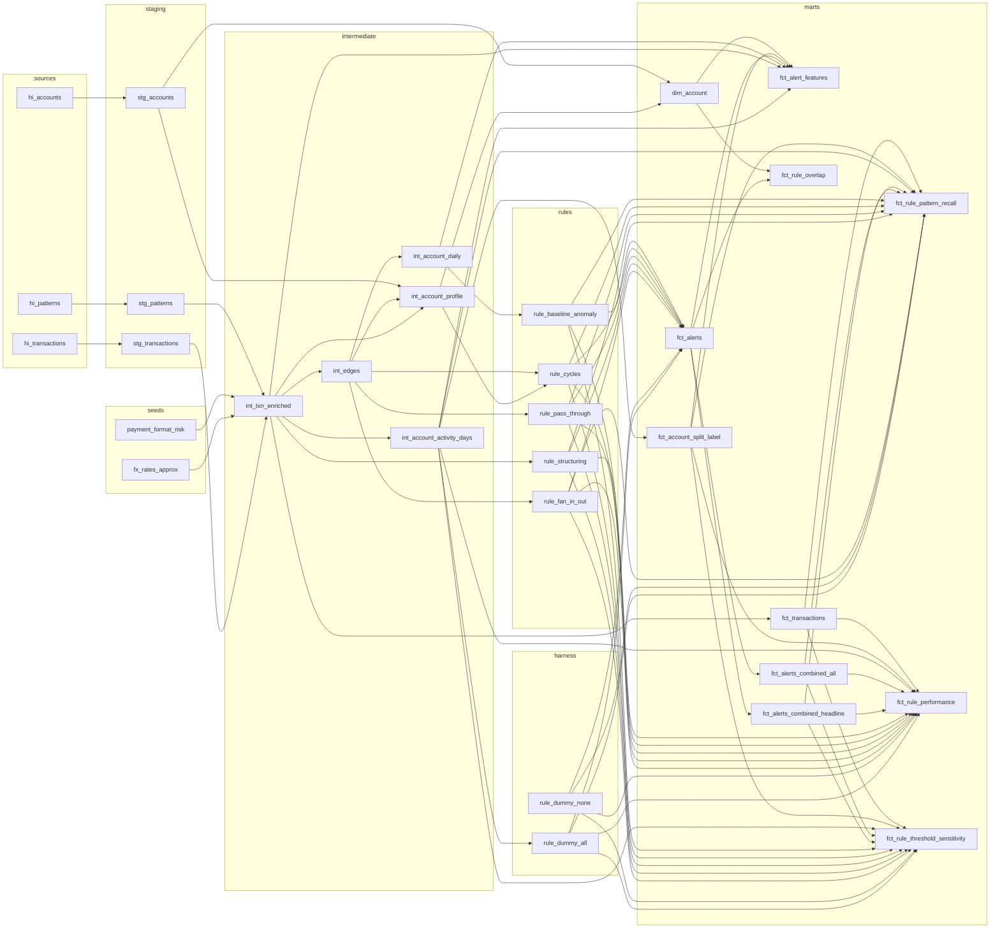

# aml-transaction-monitoring-dbt

[](https://github.com/hugomagee/aml-transaction-monitoring-dbt/actions/workflows/ci.yml)

<!-- BEGIN:headline -->
On the synthetic IBM AMLworld data, the best hand-written rule (fan-in/out) alerts on 5.0 of every 1,000 accounts at 7.1% precision against a 0.73% base rate (about 10x lift, days 8-18 of HI-Small). A gradient-boosted model on point-in-time account features does better at equal volume on HI-Small (24.5% precision at 5 alerts per 1,000 on held-out accounts after removing four features that proxy simulator behaviour; 35.4% with them), but on LI-Small it is only level with fan-in/out at that volume, so the rules are a baseline, not a detector.
<!-- END:headline -->

> **Authorship.** The dbt models, rule SQL, tests, scripts and documentation in this repository were
> written by Claude Code (an AI coding assistant), including the five detection rules in `models/rules/`
> (written under an explicit "autopilot rules" instruction; each file is marked
> `-- AUTHORED BY CLAUDE CODE`). Hugo specified the project, designed the evaluation (alert unit,
> per-split labels, the tune/validate split, the rule-selection criterion), made the design decisions and
> reviewed the results. This is a portfolio project on **synthetic** data, not a production AML system.

## Input

**Data.** IBM AMLworld, a synthetic bank-transaction dataset with ground-truth laundering labels
(Kaggle `ealtman2019/ibm-transactions-for-anti-money-laundering-aml`). `HI-Small` is used for
development; `LI-Small` is a never-tuned out-of-sample check. Only these six files are downloaded
(`make data`, via kagglehub): `{HI,LI}-Small_Trans.csv`, `{HI,LI}-Small_accounts.csv`,
`{HI,LI}-Small_Patterns.txt`. The raw files are gitignored.

| | HI-Small | LI-Small |
|---|---|---|
| transactions | 5,078,345 | 6,924,049 |
| laundering transactions | 5,177 (0.10%) | 3,565 (0.05%) |
| window | 18 days (2022-09-01 to 09-18) | 17 days |
| accounts table rows | 518,581 | 712,688 |
| pattern groups in `Patterns.txt` | 370 (cover 62% of laundering rows) | 117 (cover 29%) |

**Licence and attribution.** The data is by Erik Altman (IBM), published on Kaggle under the Community Data
License Agreement – Sharing – Version 1.0 ([text](https://cdla.dev/sharing-1-0/)); the dataset page asks
anyone who publishes papers using it to cite the generator paper and code it links. The full data is not in
this repository. `ci/sample/` holds a modified subset (rows removed, gzipped) redistributed under the same
agreement, with the required credit and change notice in [ci/sample/NOTICE.md](ci/sample/NOTICE.md).

All of these come from `python scripts/eda.py` (output in [docs/eda_notes.md](docs/eda_notes.md)).

**Things in the raw data that shaped the model** (each is handled in staging and has a test):

- The transactions header has two columns both called `Account`; they are renamed `from_account` and
  `to_account` at ingestion.
- Bank ids are zero-padded in the transactions and patterns files (`010`) but not in the accounts file
  (`10`). Staging normalises them to the integer form; without this no transaction joins to an account.
- An account is identified by `(bank, account)`, not the account number alone: four account numbers
  appear at two banks each.
- Volume is uneven: 0.2M to 1.1M transactions a day for days 1-10, then under 400 a day, while
  laundering transactions continue (8 to 232 a day). The Kaggle page describes Sep 1-10 as the "primary"
  period of activity and notes that transactions after it are laundering; in HI-Small, days 11-18 hold 1,108
  transactions of which 655 (59%) are laundering, against 0.10% before. Only 10 of the 361,568 validate accounts
  are first active after day 10 (all 10 are labelled).
- About 11.6% of rows are self-transfers (mostly `Reinvestment`); 9 exact duplicate rows are kept so that
  label counts reconcile with the raw file.
- 15 currencies and no FX table; labels sit on transactions, not accounts; `Patterns.txt` covers only
  part of the laundering rows, so it is used to tag pattern type for diagnosis and never as the label.

## Transformation

dbt-core with dbt-duckdb, local and free. Every model has key, relationship and accepted-value tests,
plus singular tests (label counts reconcile between layers, alerts reference valid accounts and carry a
reason, labels do not leak across time splits, features are point-in-time). CI runs the full
`dbt build` on a committed 100,000-row sample.



**Lineage (dbt models):**

<!-- BEGIN:lineage -->


Generated from `target/manifest.json` (`python scripts/update_readme.py`); the `li_*` sources mirror `hi_*`.
<!-- END:lineage -->

**Decisions that matter for the numbers**

- *Alert unit is the account.* An account is labelled in a split only if it is an endpoint of a laundering
  transaction **inside that split's window** (`fct_account_split_label`), so a tune label never depends
  on a later transaction (proved by a unit test and an independent re-derivation from staging).
- *Splits.* Tune = days 1-7, validate = days 8-18 (`tune_last_day` in `dbt_project.yml`). The first
  choice, "last 3 days", held only 60 accounts, all labelled, so it was replaced (`scripts/split_counts.py`).
- *FX.* `seeds/fx_rates_approx.csv` holds static, rounded early-September-2022 rates. It is an assumption,
  not data. `seeds/payment_format_risk.csv` holds generic AML priors fixed before looking at labels.
- *Evaluation harness.* One macro defines every metric (precision, recall, alerts per 1,000 accounts,
  precision@k, recall by pattern type, threshold sensitivity, rule overlap). It is proved with an
  "alert everyone" rule (recall 1, precision equal to the base rate) and an "alert nobody" rule.
- *Rule selection.* Each rule's parameters were chosen on the tune split only: highest account recall
  within 10 alerts per 1,000 accounts. Rules alert once per account per day the condition holds.

| rule | what it flags (tuned defaults) |
|---|---|
| `rule_fan_in_out` | an account receiving from, or paying, at least 6 distinct counterparties within 6 hours |
| `rule_structuring` | at least 4 payments of 7,000-10,000 USD (30% band under a 10,000 threshold) within 72 hours |
| `rule_pass_through` | at least 80% of an incoming payment of 5,000 USD or more forwarded to others within 1 hour |
| `rule_cycles` | time-ordered money loops of 3-6 hops, each leg at least 500 USD, within 168 hours, skipping hubs with more than 50 counterparties (recursive CTE) |
| `rule_baseline_anomaly` | a day's activity at least 3x the account's median earlier day, at least 5,000 USD, with 2+ earlier days |

**ML comparison.** A gradient-boosted model on point-in-time per-split account features (nothing computed
over the whole window; no hub degrees from the whole window, no pattern tags, nothing derived from the
label) is trained on the tune window and tested on the validate window with an account-grouped split (no
account in both train and test), then applied once to LI-Small. It is compared with the rules at equal
alerts per 1,000 accounts. An ablation retrains the same model without four features that proxy how the
simulator assigns currencies, formats and self-transfers; the exclusion list was fixed before it was run.

## Output

Account-level results on HI-Small (rules tuned on tune; validate is days 8-18) and on LI-Small with the
defaults frozen and each rule run once:

<!-- BEGIN:results -->
| rule | HI tune: precision / recall / alerts per 1,000 / lift | HI validate: precision / recall / per 1,000 / lift | LI-Small (frozen, whole window): precision / recall / per 1,000 / lift |
|---|---|---|---|
| rule_fan_in_out | 6.6% / 6.3% / 7.6 / 8.4x | 7.1% / 4.9% / 5.0 / 9.7x | 6.9% / 9.4% / 10.2 / 9.2x |
| rule_structuring | 1.9% / 2.4% / 9.8 / 2.4x | 1.3% / 4.4% / 24.8 / 1.8x | 1.8% / 4.3% / 18.2 / 2.4x |
| rule_pass_through | 1.8% / 2.0% / 8.8 / 2.3x | 2.9% / 1.6% / 4.1 / 3.9x | 1.8% / 2.7% / 11.1 / 2.4x |
| rule_cycles | 15.7% / 0.8% / 0.4 / 19.8x | 25.0% / 2.9% / 0.8 / 34.1x | 13.2% / 1.2% / 0.7 / 17.6x |
| rule_baseline_anomaly [*] | 12.4% / 12.9% / 8.2 / 15.7x | 2.5% / 28.7% / 84.4 / 3.4x | 2.2% / 19.5% / 65.4 / 3.0x |
| combined_excl_baseline | 3.3% / 10.3% / 25.0 / 4.1x | 2.8% / 12.4% / 33.2 / 3.7x | 3.2% / 15.5% / 36.8 / 4.2x |

Base rates (share of active accounts that are labelled): HI tune 0.79%, HI validate 0.73%, LI whole window 0.75%. Lift = precision / base rate. [*] rule_baseline_anomaly does not transfer across days (8.2 alerts/1,000 on tune vs 84 on validate; cold-start baseline) and is left out of the combined headline set. Full tables, recall by pattern type and rule overlap: [docs/rule_results.md](docs/rule_results.md).
<!-- END:results -->

ML versus the rules at equal alert volume:

<!-- BEGIN:ml -->
**HI-Small validate window, account-disjoint test accounts** (base rate 0.75%, 108,440 accounts)

| method | PR-AUC | precision (recall) at 1 / 1,000 | at 5 / 1,000 | at 10 / 1,000 |
|---|---|---|---|---|
| rule_fan_in_out | 0.012 | 6.5% (0.9%) | 5.9% (3.6%) | 5.9% (3.6%) at only 4.55/1,000 |
| rule_cycles | 0.035 | 30.5% (3.6%) at only 0.88/1,000 | 30.5% (3.6%) at only 0.88/1,000 | 30.5% (3.6%) at only 0.88/1,000 |
| combined_excl_baseline | 0.010 | 2.8% (0.4%) | 2.7% (1.8%) | 2.7% (3.6%) |
| ML base | 0.235 | 73.1% (9.7%) | 35.4% (23.5%) | 24.3% (32.2%) |
| ML base, no artifact features | 0.131 | 52.8% (7.0%) | 24.5% (16.3%) | 16.1% (21.3%) |
| ML base+rules | 0.195 | 77.8% (10.3%) | 29.0% (19.2%) | 18.6% (24.8%) |

**LI-Small validate window, HI-trained model applied once** (base rate 0.37%, 492,785 accounts)

| method | PR-AUC | precision (recall) at 1 / 1,000 | at 5 / 1,000 | at 10 / 1,000 |
|---|---|---|---|---|
| rule_fan_in_out | 0.019 | 10.4% (2.8%) | 6.6% (8.6%) | 6.6% (8.6%) at only 4.83/1,000 |
| rule_cycles | 0.016 | 11.6% (1.8%) at only 0.58/1,000 | 11.6% (1.8%) at only 0.58/1,000 | 11.6% (1.8%) at only 0.58/1,000 |
| combined_excl_baseline | 0.007 | 5.7% (1.5%) | 2.7% (3.6%) | 2.1% (5.6%) |
| ML base | 0.074 | 24.9% (6.7%) | 10.5% (14.1%) | 7.6% (20.4%) |
| ML base, no artifact features | 0.048 | 16.2% (4.4%) | 6.3% (8.6%) | 5.0% (13.5%) |
| ML base+rules | 0.055 | 21.1% (5.7%) | 7.5% (10.1%) | 4.8% (13.1%) |

`ML base, no artifact features` drops `f_n_currencies`, `f_n_self`, `f_frac_risky_format` and `f_frac_cross_currency`, an exclusion list declared before the ablation was run (same model and split; one ablation configuration, see the reproducibility note in docs/ml_results.md). Equal-volume comparison, ties resolved pro rata; a rule with fewer alerts than the budget uses all of them. Details, caveats and feature importances: [docs/ml_results.md](docs/ml_results.md).
<!-- END:ml -->

Reading these honestly: fan-in/out and cycles are the useful rules (fan-in/out about 8-10x the base rate at
5-10 alerts per 1,000; cycles about 18-34x but at under 1 alert per 1,000, so it finds very little);
structuring and pass-through are only about 2-4x; baseline anomaly does not transfer across days. The full-feature ML model is far ahead of every rule at equal volume. Removing four features that were
declared in advance as simulator-artifact proxies (currency count, self-transfers, risky-format share,
cross-currency share; together about 43% of its importance) cuts its precision at equal volume by roughly a
third and its PR-AUC by 44% on HI-Small, but it still beats every rule that can fill the budget there. On
LI-Small the artifact-free model is ahead of the rules at 1 and 10 alerts per 1,000 and level with fan-in/out
at 5 per 1,000. What remains (USD amounts, volume, degree, timing) could still encode simulator behaviour, so
this is a statement about this dataset, not evidence that ML would find real laundering.

Other outputs: `fct_alerts` (rule_id, account_id, alert_ts, score, reason, one row per account per day per
rule), `fct_rule_*` evaluation marts, `fct_alert_features`, [docs/rule_results.md](docs/rule_results.md),
[docs/ml_results.md](docs/ml_results.md), [docs/eda_notes.md](docs/eda_notes.md).

## Limitations

- **Synthetic data, generated from the patterns the rules look for.** Rules that match the generator's
  patterns are being tested on the generator, not on real laundering; real data is messier. Good results
  here are not evidence about real-world detection.
- **Short, uneven window.** 18 days, with volume collapsing after day 10 (under 400 transactions a day for
  days 11-18), so the validate split is mostly days 8-10.
- **Static, approximate FX** and an **approximate format-risk seed**: amounts in USD and the structuring
  band are only as good as those rounded assumptions.
- **Validate is not a pristine holdout.** `make eval` prints every split, so validate was seen at each
  rule's untuned defaults before tuning, and that view prompted one design change (alert once per account
  per day instead of only the first time). Parameter selection itself used tune-split metrics only
  (disclosed in [docs/rule_results.md](docs/rule_results.md)). The LI-Small run, never tuned on, is the
  clean out-of-sample check.
- **Look-ahead in the cycles hub cap.** The degree cap uses degrees computed over the whole window. This is
  structural (hub status, not labels), but it is look-ahead the ML features deliberately avoid; the
  rules-as-features model inherits it.
- **Cycles recall is low** (under 3%) because looser amount floors did not run: 250 USD exhausted memory
  and 100 USD filled the disk with spill files. The 500 USD floor is a compute constraint, not a
  tuned optimum, and the cap on DuckDB's temp spill (`profiles.yml`) exists because of that.
- **Baseline anomaly does not transfer across days:** 8.2 alerts per 1,000 accounts on tune versus 84 on
  validate, because the baseline needs earlier active days and accounts accumulate history over time
  (a cold-start problem). It is excluded from the combined headline set.
- **Structuring uses a loose band.** The tuning criterion chose a 30% band (7,000-10,000 USD); that is
  "below the threshold", not "just below" it.
- **The ML lead is partly a generator artifact, and may be more.** Four features that proxy how the
  simulator assigns currencies, formats and self-transfers carried about 43% of the full model's importance;
  removing them (an exclusion list declared in advance) cuts precision at equal volume by roughly a third
  but leaves the model ahead of the rules on HI-Small and mostly level-to-ahead on LI-Small. The features
  that remain (USD amounts, volume, degree, timing) could still encode simulator behaviour, so the ML-over-rules
  result is a statement about this dataset only.
- **The account label is a derived choice** (endpoint of any laundering transaction), and labels here are
  perfect, unlike reality.
- **No case management, sanctions or KYC data**; no analyst feedback; no rule retraining over time.
- **The CI sample** (`ci/sample/`, 100,000 rows) is a hash sample that keeps every laundering row but
  breaks graph structure; it proves the pipeline builds and its tests hold, not that the rules perform.
  It is a modified subset of CDLA-Sharing-1.0 data, redistributed with the credit and change notice the
  licence requires ([ci/sample/NOTICE.md](ci/sample/NOTICE.md)); the repository's own code has no licence
  file yet.

## Reproduce

```bash
make setup                  # virtualenv + requirements (Python 3.12)
make data                   # download the six HI/LI-Small files (kagglehub, no token needed)
make load                   # raw CSVs -> DuckDB (data/aml.duckdb)
make build                  # dbt seed + build (all models and tests, incl. the five rule fixtures)
make results                # docs/rule_results.md from the evaluation marts
make ml                     # docs/ml_results.md (equal-volume ML vs rules)
make ci                     # reproduce CI: build on the committed 100k sample
python scripts/update_readme.py   # regenerate the generated blocks of this README
```

LI-Small (never tuned on): `AML_DB=data/li.duckdb python scripts/load_raw.py li`, then
`AML_DB=data/li.duckdb dbt build --vars '{dataset: li}'` (needs about 1.5 GB of free disk).
Evaluate one rule: `make eval RULE=rule_fan_in_out` (runs its fixture first); fixtures only:
`make test-rule RULE=rule_fan_in_out`.

## What I'd do next

- Re-run on real or less synthetic transaction data; the largest open question is whether anything here
  survives contact with data not produced by the patterns being detected.
- Make every rule strictly point-in-time, not only the features the ML model uses.
- Use rolling-origin tuning and evaluation instead of one tune/validate cut; re-tune the baseline rule with
  a warm start so it transfers across days.
- Add a real FX table and a defensible, documented risk weighting per payment format.
- Make the cycles search cheaper (degree-aware pruning, per-day batching) so lower amount floors fit in
  memory, and report recall again.
- Add case-management feedback as a label source.
- Run an exploratory second ablation that drops the USD-amount features, to test whether currency mix still
  leaks simulator behaviour into the model (it would be a post-hoc list, so it would not change any claim above).
- Tune each rule's precision under a real investigator-capacity constraint (alerts per analyst per day) instead of
  the single 10-alerts-per-1,000 budget used here.
- Give the cycles rule point-in-time hub degrees (degree as of the alert time) in place of the whole-window degree.

## Licence

The code in this repository is released under the [MIT licence](LICENSE). The data sample in `ci/sample/` is
a modified subset of the IBM AMLworld data and stays under the Community Data License Agreement – Sharing –
Version 1.0, with credit to the data provider and a change notice in [ci/sample/NOTICE.md](ci/sample/NOTICE.md);
the MIT licence does not cover it. That reading of the data licence is mine, not legal advice.
